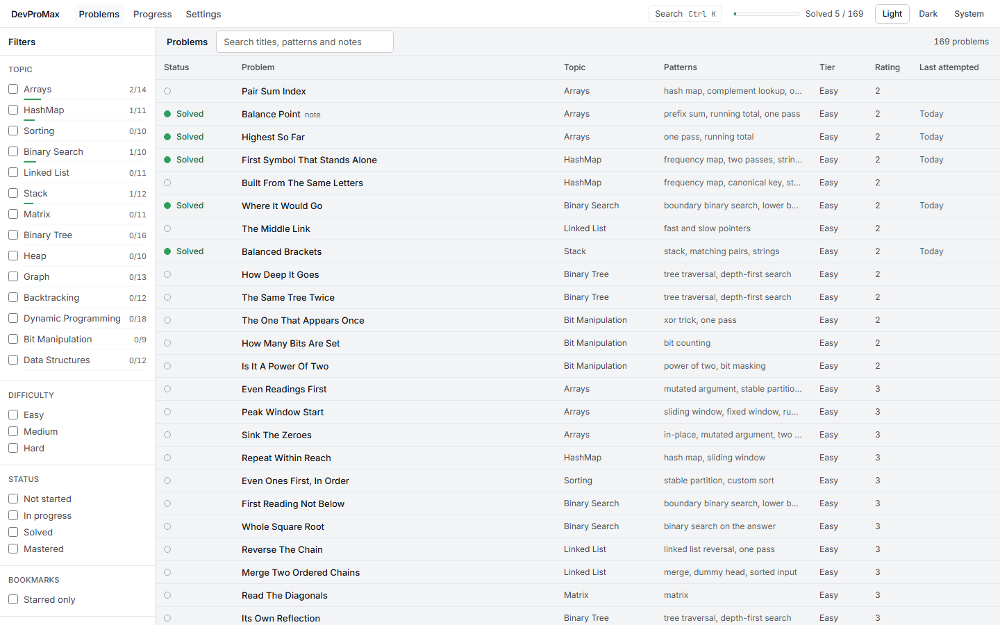
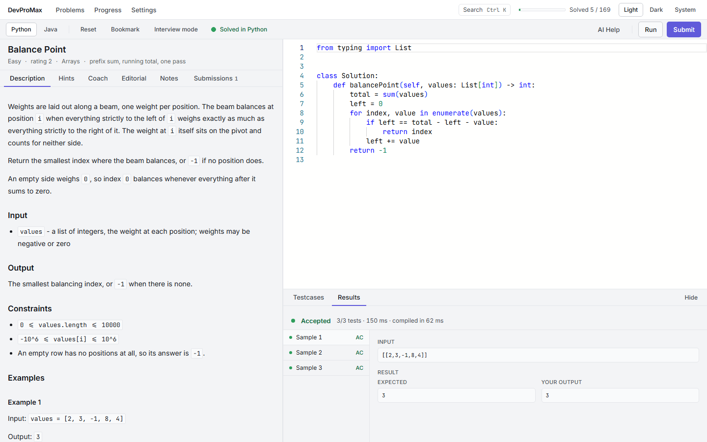
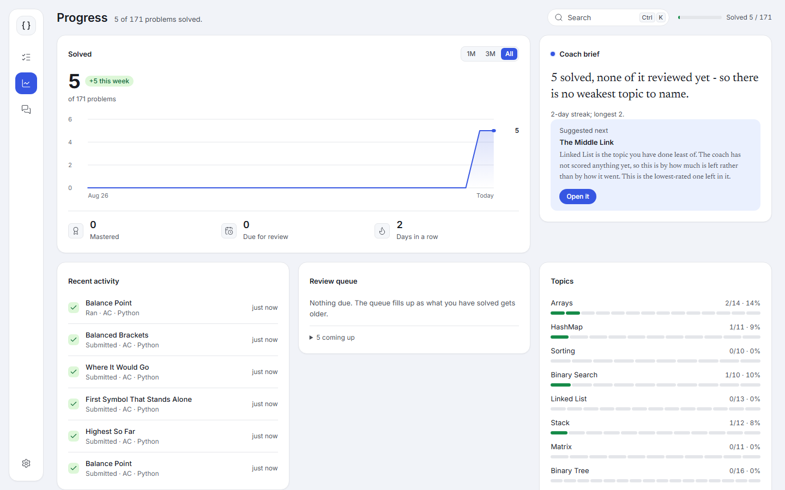
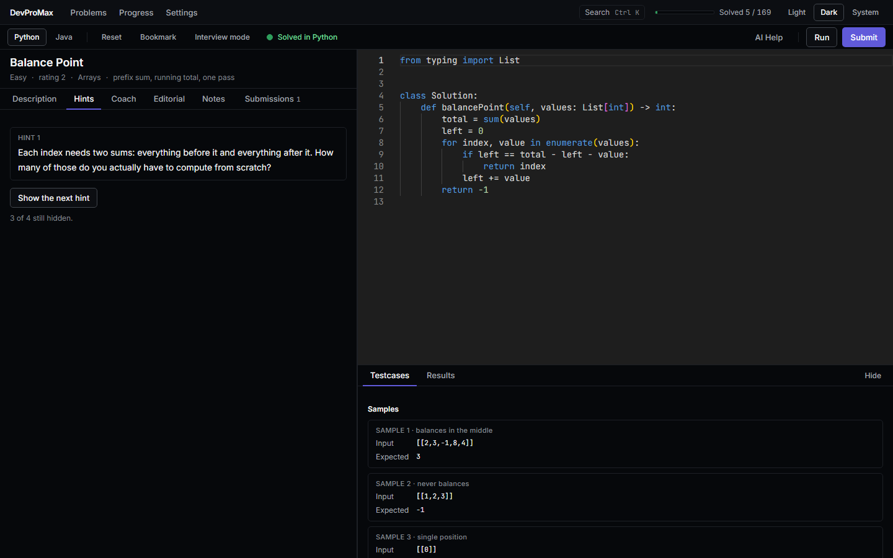

# DevProMax

A local-first, LeetCode-style trainer for data-structures and algorithms interview prep, in
**Python and Java**. 171 original problems, a judge that runs your code on your own machine, and an
on-demand LLM coach that reviews what you have written rather than handing you the answer.

Nothing leaves the machine except a coach request you asked for, with a key you supplied.



## Quick start

```
npm install
npm run dev                # web on 127.0.0.1:5173, API on 127.0.0.1:5174
```

Or the shipped shape — one process, one port, both halves:

```
npm start                  # builds, then serves on 127.0.0.1:5174
```

The judge shells out to `python` and `javac`/`java`, so it needs **Python 3.10+** and a **JDK 21+**
on your `PATH`. To check before you wonder why a Run failed:

```
npm run doctor
```

It names what is missing, what to install, and the environment variable to set if you would rather
point at a runtime you already have (`DEVPROMAX_PYTHON`, `DEVPROMAX_JAVA`, `DEVPROMAX_JAVAC`).
Settings › Runtimes runs the same check from inside the app.

### Running code in Docker instead

If Docker is installed, the judge can run every step in a throwaway container with no network, a
read-only filesystem and memory and process limits, and then needs no local Python or JDK:

```
docker pull python:3.14-slim
docker pull eclipse-temurin:21-jdk
DEVPROMAX_EXECUTOR=docker npm start       # PowerShell: $env:DEVPROMAX_EXECUTOR='docker'; npm start
```

It costs about a second per Run for the container starts. `npm run doctor` checks Docker and both
images when the variable is set. The containers carry the label `devpromax.judge=1`, if something
watching your Docker daemon should ignore them.

## The loop



**Run** (`Ctrl+Enter`) tries your code against the visible samples and any cases you add. It records
nothing. **Submit** (`Ctrl+Shift+Enter`) runs every hidden test and writes the verdict down; that is
what moves a problem to Solved. A status only ever improves — a later wrong answer never takes
Solved away.

**AI Help** (`Ctrl+Shift+H`) is the coach, and it is on demand only: nothing calls a vendor on a Run
or a Submit. It scores five rubric dimensions, picks the lowest hint rung that unblocks you, and
will not produce a full solution unless the problem is already solved _and_ you asked for one. It
needs your own Anthropic or Gemini key, set in Settings, and tells you what a turn costs before you
spend it.

`Ctrl+K` opens the command palette from anywhere: any problem by name, the next recommended one (the
easiest unsolved problem in your weakest topic), a random unsolved one, or something due for review.

## What it keeps track of



Per-topic and per-tier progress, a streak calendar, recent activity, and — once the coach has scored
something — which topics you are weakest at, from its rubric marks rather than from a guess. Solved
problems come back after 3, 7 and 21 days for a re-solve with the hints shut; mastered ones on double
those intervals. The skills report exports as JSON, markdown, or a single self-contained HTML file
that carries what you can do and none of your code.

Interview mode adds a stopwatch or a countdown, hides the hints and the editorial while it runs, and
records how long the solve took.



## Where your data is

One SQLite file: `data/devpromax.db`. `DEVPROMAX_DATA` moves the whole directory,
`DEVPROMAX_DB` moves just the file.

```
npm run db:backup                  # a consistent copy, named by the moment
npm run db:restore -- <file>       # put one back; the displaced one is kept beside it
```

Backups use SQLite's `VACUUM INTO`, so they are safe to take while the app is running.

## Problems

Each problem is a directory under `problems/<topic>/<slug>/`: a statement, visible samples, a
generator that produces the hidden tests with the reference solution as the oracle, a four-rung hint
ladder, an editorial, and starter plus reference code in both languages. `docs/PROBLEM_FORMAT.md`
specifies the format and `docs/AUTHORING.md` is the how-to.

```
npm run problems:validate          # schema, and both references pass, for every problem
npm run problems:new <topic> <slug>
npm run problems:gen <slug>        # regenerate hidden tests
```

## Development

```
npm test                   # unit, contract and judge integration
npm run test:unit          # everything except the tests that spawn interpreters
npm run test:e2e           # Playwright, against a real server and a real judge
npm run lint && npm run typecheck
npm run perf:lighthouse    # performance and accessibility, both themes, on the built app
```

`CLAUDE.md` is the working agreement — stack decisions, conventions, and what not to add.

## Documentation

- [ROADMAP.md](ROADMAP.md) — goals, the architecture decisions (D1–D25), the prioritised task table
- [CHANGELOG.md](CHANGELOG.md) — what shipped, and why, newest first
- [docs/ARCHITECTURE.md](docs/ARCHITECTURE.md) — how the pieces fit and where the seams are
- [docs/PROBLEM_FORMAT.md](docs/PROBLEM_FORMAT.md) — the problem package format
- [docs/AUTHORING.md](docs/AUTHORING.md) — writing a problem
- [docs/CURRICULUM.md](docs/CURRICULUM.md) — the catalogue, topic by topic
- [docs/DESIGN.md](docs/DESIGN.md) — the design system and its review checklist
- [docs/COACH_PROMPTS.md](docs/COACH_PROMPTS.md) — how the coach is instructed
- [temp/](temp/) — archived content from the previous version of this repo; not used by the app
